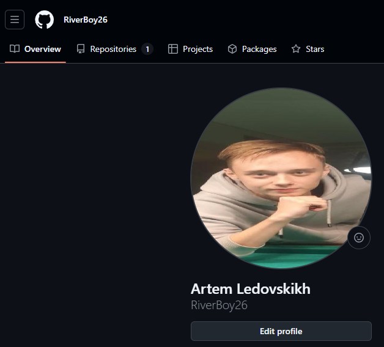
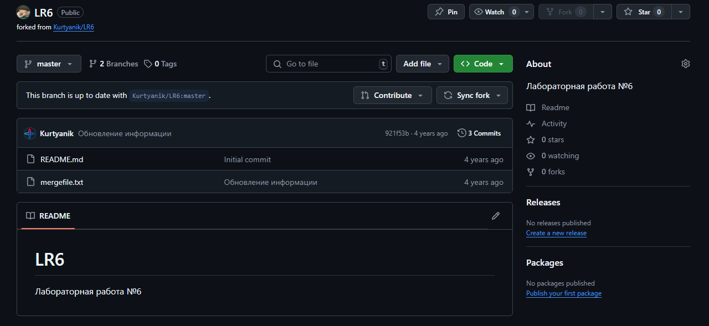
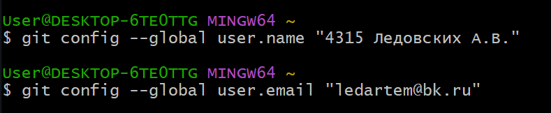
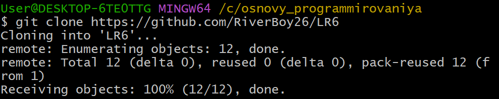
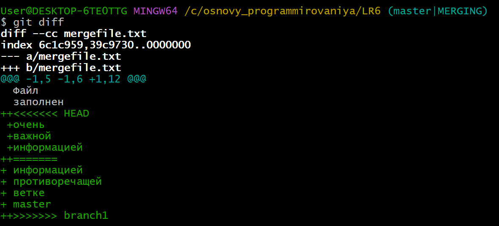
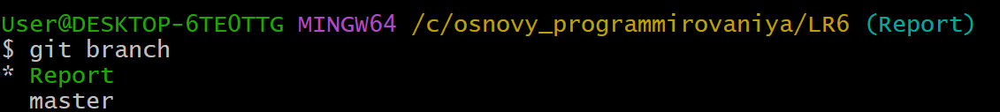
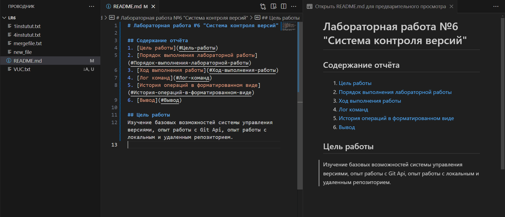
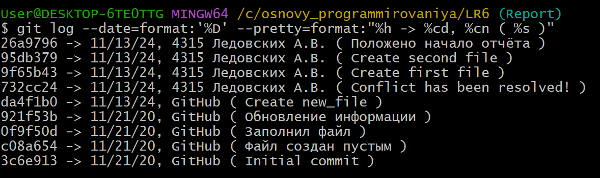

# Лабораторная работа №6 "Система контроля версий"

## Содержание отчёта
1. [Цель работы](#Цель-работы)
2. [Порядок выполнения лабораторной работы](#Порядок-выполнения-лабораторной-работы)
3. [Ход выполнения работы](#Ход-выполнения-работы)
4. [Лог команд](#Лог-команд)
5. [История операций в форматированном виде](#История-операций-в-форматированном-виде)
6. [Вывод](#Вывод)

## Цель работы
Изучение базовых возможностей системы управления версиями, опыт работы с Git Api, опыт работы с локальным и удаленным репозиторием.

## Порядок выполнения лабораторной работы
1. Создать аккаунт на сайте GitHub.
2. Сделать копию в личное хранилище из
https://github.com/Kurtyanik/LR6/ (Fork).
3. Установить Git (https://git-scm.com/).
4. После установки настроить клиент git, введя имя пользователя (Группа
Фамилия И.О.) и email.
5. Клонировать свой личный удалённый репозиторий на компьютер.
6. Добавить файл через интерфейс GitHub. Подтянуть изменения в
локальный репозиторий.
Работу продолжать локально.
7. Получить историю операций для каждой из веток.
8. Просмотреть последние изменения.
9. Выполнить слияние в ветку master, разрешив конфликт (можно
использовать специальные редакторы или графический интерфейс git).
10. Удалить побочную ветку после успешного слияния.
11. Сделать изменения и зафиксировать их, оставляя комментарии, несколько раз.
12. Сделать откат коммита.
13. Создать ветку для отчёта. 
14. Начать оформлять отчёт в файле README.md (разрешены сторонние
редакторы с подсветкой синтаксиса), используя markdown синтаксис
(https://guides.github.com/features/mastering-markdown/):
 - В отчёте должен быть снимки экрана консоли и сторонних программ.Файлы снимков экрана разместить в отдельной папке.
 - Лог команд (без результатов их выполнения).
При написании отчёта периодически делать коммиты, не забывать
комментировать.
15. Получить историю операций в форматированном виде (сокращённый
хэш + дата + имя автора + комментарий). Добавить её в отчёт и сделать
финальную фиксацию изменений.
16. Отправить локальные изменения в сетевое хранилище GitHub (если
делаете работу постепенно, то синхронизацию проводить в конце рабочего
сеанса) 

## Ход выполнения работы
### 1. Cоздание аккаунта на GitHub
Чтобы создать аккаунт на сайте GitHub, необходимо перейти на данную страницу: https://github.com/signup — и заполнить форму регистрации (рис. 1).
<p align="center"></p>
<p align="center">Рисунок 1 - зарегистрированный аккаунт на GitHub</p>

### 2. Создание копии в личном хранилище из https://github.com/Kurtyanik/LR6/ (Fork).

Следующим шагом является создание копии репозитория. Для этого нужно перейти на репозиторий преподавателя, указать параметры копирования (рис. 2) и создать копию (fork) (рис. 3).
<p align="center"></p>
<p align="center">Рисунок 2 - Настройки копирования репозитория</p>

<p align="center"></p>
<p align="center">Рисунок 3 - Скопированный репозиторий</p>

### 3. Установка Git
Чтобы установить Git, необходимо перейти на страницу https://git-scm.com (рис. 4) и, выбрав нужную версию Git, скачать её.
<p align="center"></p>
<p align="center">Рисунок 4 - Страница для установки Git</p>

### 3. Настройка клиента Git
Чтобы указать имя пользователя и email в клиенте Git, необходимо воспользоваться соответствующими командами:
```
git config --global user.name "(username)"
git config --global user.email "(email)"
```
Настройка клиента Git представлена на рисунке 5.
<p align="center"></p>
<p align="center">Рисунок 6 - Настройка клиента git</p>

### 5. Клонирование удалённого репозитория на компьютер
Для клонирования своего личного удалённого репозитория на компьютер сначала нужно перейти в папку, где должен храниться репозиторий. Это осуществляется с помощью команды:
```
cd (путь)
```
Затем, можно клонировать удалённый репозиторий на свой компьютер (рис. 6) с помощью следующей команды:
```
git clone (ссылка на удалённый репозиторий)
```
<p align="center"></p>
<p align="center">Рисунок 6 - Клонирование удалённого репозитория на компьютер</p>

### 6. Добавление файла через интерфейс GitHub. Подтягивание изменений в локальный репозиторий
Чтобы добавить файл через интерфейс GitHub, нужно нажать на кнопку "Add file", а затем перейти в "Create new file" (рис. 7). 
<p align="center"></p>
<p align="center">Рисунок 7 - Открытие интрефейса для создания файла</p>

Далее необходимо написать название файла и его содержимое (рис. 8).
<p align="center"></p>
<p align="center">Рисунок 8 - Создание файла</p>

После подтверждения изменений, созданный файл появится в репозитории(рис. 9).
<p align="center"></p>
<p align="center">Рисунок 9 - Созданный файл</p>

Чтобы установить изменения в локальном репозитории, необходимо в него перейти и воспользоваться командой:
```
git pull
```
Чтобы просмотреть файлы в локальном репозитории, необходимо ввести команду:
```
ls -1
```
На рисунке 10 представлены файлы репозитория до и после добавления 'new_file'.
<p align="center"></p>
<p align="center">Рисунок 10 - Установка изменений в локальном репозитории</p>

### 7. Получение истории операций для каждой из веток
Чтобы получить историю операций для каждой ветки, необходимо на каждой ветки выполнить команду:
```
git log (Название ветки)
```
Так, при выполнении команды `git log master` в консоль выводится история операция для ветки master (рис. 11).

<p align="center"></p>
<p align="center">Рисунок 11 - История операций ветки master</p>

Чтобы перейти на другую ветку можно воспользоваться командой:
``` 
git checkout (название ветки)
```
После перехода на ветку branch1 необходимо выполнить команду `git log branch1`, чтобы получить историю операций данной ветки (рис. 12).
<p align="center"></p>
<p align="center">Рисунок 12 - История операций ветки branch1</p>

### 8. Просмотр последних изменений
Чтобы просмотреть последние изменения, нужно на каждой ветке выполнить команду:
```
git show (Название ветки)
```
Так, находясь на ветке branch1, можно выполнять команду `git show branch1`. В результате получим последние изменения на ветке branch1 (рис. 13).

<p align="center"></p>
<p align="center">Рисунок 13 - Последние изменения ветки branch1</p>

Затем необходимо выполнить команду `git show master`, при этом находясь на ветке master, чтобы получить последние изменения ветки mastert (рис. 14).

<p align="center"></p>
<p align="center">Рисунок 14 - Последние изменения ветки master</p>

### 9. Выполнение слияния в ветку master, разрешив конфликт
Чтобы слить две ветки нужно перейти на ветку в которую нужно слить файлы со второй ветки и воспользоваться командой:
```
git merge (Название второй ветки)
```
При попытке слить в ветку master ветку branch1 возникает конфликт (рис. 15).
<p align="center"></p>
<p align="center">Рисунок 15 - Появление конфликта при слияние</p>

Чтобы посмотреть в консоли подробности конфликта (рис. 16), можно воспользоваться командой:
```
git diff
```
<p align="center"></p>
<p align="center">Рисунок 16 - Конфликт в консоли</p>

Чтобы разрешить конфликт можно использовать специальные редакторы или графический интерфейс git. Для разрешения данного конфликта был использован редактор Notepad++ (рис. 17).

<p align="center"></p>
<p align="center">Рисунок 17 - Разрешение конфликта в NotePad++</p>

После того как конфликт разрешён, полученный файл необходимо зафиксировать. Для этого сначала добавляем его в индекс с помощью команды:
```
git add (Название файла)
```
Затем проверям, что он добавился в индекс:
```
git status
```
И последним шагом фиксируем изменения, чтобы завершить слияние (рис. 18) с помощью команды:
```
git commit -m "(Комментарий)"
```
Чтобы передать все изменения в ветке master в удалённый репозиторий, необходимо воспользоватсья командой:
```
git push
```
<p align="center"></p>
<p align="center">Рисунок 18 - Завершение слияния веток</p>

### 10. Удаление побочной ветки 
После успешного слияния ветка branch1 больше не нужна и её нужно удалить (рис. 19). 

Сначала её нужно удалить локально с помощью команды:
```
git branch -d (Название ветки)
```
Затем её нужно удалить из удалённого репозитория:
```
git push origin --delete branch1
```
<p align="center"></p>
<p align="center">Рисунок 19 - Удаление ветки branch1</p>

### 11. Создание изменений и их фиксация (с комментариями);
Чтобы создать текстовый файл или сделать изменения в уже существующем файле можно воспользоваться командой:
```
echo "Новый текст файла" > (Название файла).txt
```
Были созданы файлы 1institut.txt и 4institut.txt. Оба раза изменения репозитория фиксировались с комментариями (рис. 20 - 21)
<p align="center"></p>
<p align="center">Рисунок 20 - Первое создание файла</p>

<p align="center"></p>
<p align="center">Рисунок 21 - Второе создание файла</p>

### 12. Создание отката коммита
Перед откатом коммита необходимо проверить их историю (рис. 22), чтобы после отката можно было убедиться, что всё прошло успешно. Проверить историю можно с помощью команды:
```
git log
```
<p align="center"></p>
<p align="center">Рисунок 22 - Проверка истории коммитов</p>

Для откада последнего коммита необходимо воспользоваться командой:
```
git reset HEAD~1
```
После отката последнего коммита ещё раз была использвана команда `git log`. До отката последний коммит был "Create second file", а после стал "Create first file", значит откат прошёл успешно (рис. 23).
<p align="center"></p>
<p align="center">Рисунок 23 - Откат последнего коммита и проверка истории коммитов</p>

### 13. Создание ветки для отчёта(Report)
Для создания ветки для отчёта (рис. 24) необходимо воспользоваться командой:
```
git branch (Название новой ветки)
```
А чтобы посмотреть какие существуют ветки (рис. 25), можно воспользоватсья командой:
```
git branch
```
<p align="center"></p>
<p align="center">Рисунок 24 - Создание ветки для отчёта Report</p>
<p align="center"></p>
<p align="center">Рисунок 25 - Проверка веток</p>

Чтобы недавно созданная локальная ветка report появилась в удалённом репозитории (рис. 26), нужно воспользоваться командой:
```
git push origin Report
```
<p align="center"></p>
<p align="center">Рисунок 26 - Отправка изменений в удалённый репозиторий</p>

### 14. Начало оформления отчёта в файле README.md
Ещё одним важным требованием для выполнения лабораторной работы является написание отчёта в файле README.md. Для удобного форматирования этого файла был выбран редактор кода VS Code (рис. 27)
<p align="center"></p>
<p align="center">Рисунок 27 - Написание отчёта в файле README.md</p>

### 15. Получение истории операций в форматированном виде
Чтобы получить историю операций в форматированном виде (рис. 28) (сокращённый
хэш + дата + имя автора + комментарий), необходимо воспользоваться командой:
```
git log --date=format:'%D' --pretty=format:"%h -> %cd, %cn ( %s )"
```

<p align="center"></p>
<p align="center">Рисунок 28 - История операций в форматированном виде</p>

### 16. Отправка локальных изменений в сетевое хранилище GitHub
Чтобы отправить локальные изменения в сетевое хранилище GitHub после завершения написания отчёта нужно воспользоваться командой: 
```
git push
```
После чего все локальные изменения ветки Report появятся в удалённом репозитории

## Лог команд
<p>git config --global user.name "4315 Ледовских А.В."
<p>git config --global user.email "ledartem@bk.ru"
<p>cd /c/osnovy_programmirovaniya/
<p>git clone https://github.com/RiverBoy26/LR6
<p>cd LR6/
<p>ls -1
<p>git pull
<p>ls -1
<p>git log master
<p>git show master
<p>git checkout branch1
<p>git log branch1
<p>git show branch1
<p>git checkout master
<p>git show master
<p>git merge branch1
<p>git diff
<p>git add mergefile.txt
<p>git status
<p>git commit -m "Conflict has been resolved!"
<p>git branch -d branch1
<p>git branch
<p>git push origin --delete branch1
<p>echo "Первый всегда первый!" > 1instutut.txt
<p>git status
<p>git add 1instutut.txt
<p>git commit -m "Create first file"
<p>git push
<p>echo "Четвёртый институт - one love!" > 4instutut.txt
<p>git status
<p>git add 4instutut.txt
<p>git commit -m "Create second file"
<p>git push
<p>git log master
<p>git reset HEAD~1
<p>gi log 
<p>git log 
<p>git branch Report
<p>git checkout Report
<p>git branch
<p>git push origin Report
<p>git checkout master
<p>git push origin Report
<p>git status
<p>git add README.md
<p>git commit -m "Положено начало отчёта"
<p>git push
<p>git push origin Report
<p>git log --date=format:'%D' --pretty=format:"%h -> %cd, %cn ( %s )"

## История операций в форматированном виде
<p>26a9796 -> 11/13/24, 4315 Ледовских А.В. ( Положено начало отчёта )
<p>95db379 -> 11/13/24, 4315 Ледовских А.В. ( Create second file )
<p>9f65b43 -> 11/13/24, 4315 Ледовских А.В. ( Create first file )
<p>732cc24 -> 11/13/24, 4315 Ледовских А.В. ( Conflict has been resolved! )
<p>da4f1b0 -> 11/13/24, GitHub ( Create new_file )
<p>921f53b -> 11/21/20, GitHub ( Обновление информации )
<p>0f9f50d -> 11/21/20, GitHub ( Заполнил файл )
<p>c08a654 -> 11/21/20, GitHub ( Файл создан пустым )
<p>3c6e913 -> 11/21/20, GitHub ( Initial commit )

## Вывод
В ходе данной лабораторной работы были изучены базовые возможности системы управления версиями, а также получен опыт работы с Git Api и опыт работы с локальным и удаленным репозиторием. 

Была изучена система контроля версий Git и её интеграция с платформой GitHub. Был получен практический опыт в использовании основных функций Git, таких как создание и клонирование репозиториев, слияние веток, разрешение конфликтов, а также ведение истории изменений и операций в форматированном виде.


